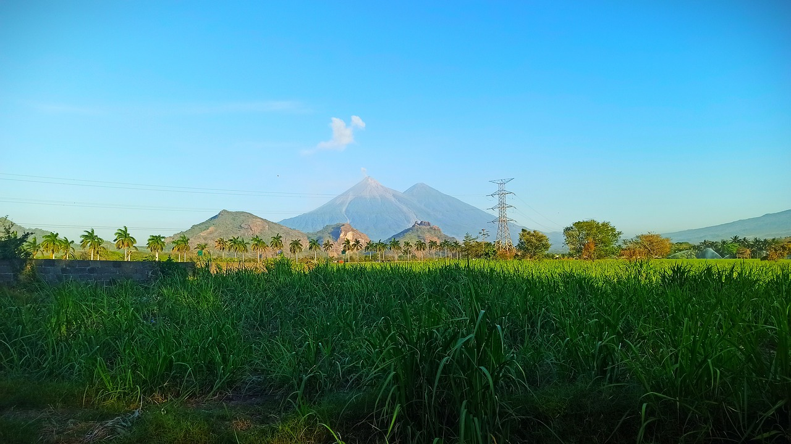

<!-- Banner -->

  

<!-- Título Principal -->
<h1 align="center">
  Biosfera Guatemala API
</h1>

<!-- Subtítulo/Caption -->
<h3 align="center">
  By Haricode
</h3>

<!-- Descripción del Proyecto -->

  

    <strong>Biosfera Guatemala API</strong> es una iniciativa pionera destinada a los desarrolladores guatemaltecos 
    apasionados por enriquecer sus habilidades de programación. Este proyecto de código abierto está enfocado en 
    compilar y distribuir información diversa sobre Guatemala. Su propósito es construir una vasta red de datos 
    accesibles que puedan ser empleados tanto dentro de nuestro país como a nivel internacional. La API ofrece 
    una oportunidad única para explorar, interactuar y contribuir a un repositorio de conocimientos que celebra 
    y preserva la riqueza cultural y natural de Guatemala.
  

<!-- Espacio para Imagen al Lado del Texto -->

  

<!-- Título del Manual Técnico -->
<h2 align="center">
  Manual Técnico
</h2>

<!-- Aquí continúa el contenido del Manual Técnico... -->
